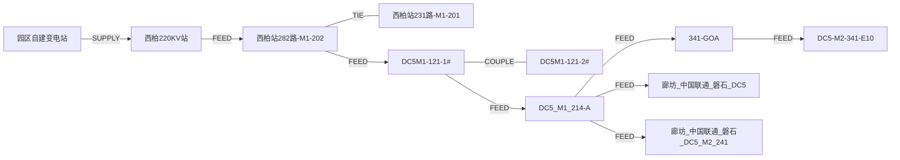

数据中心拓扑描述（基于 power.json）

### 0. 物理链路与空间层级（总览）
- 物理电力传输链路（单模组视角）：上级/自建变电站 → 高压进线柜（多台，柜间可互联） → 变压器（多台，之间可互联/自投） → UPS → 列头柜（RPP） → 机柜 → 服务器/网络设备。
- 空间层级：数据中心 → 模组（Module，虚拟逻辑单元，对应一套电力链路） → 楼宇（Building） → 房间（Room） → 列头柜（RPP）/机柜行（Row） → 机柜（Cabinet） → 终端设备（Server/NetworkDevice）。
- 上述“模组”层可将多个物理楼宇/房间划归同一套电力链路，便于分域管理。
- 多套关系描述（电与空间双视角）：
  1) 供电链路可被多个模组复用：同一上级/自建变电站可以向多个模组/多条高压进线柜馈电（多 FEED 出口）；模组间可共享高压侧。
  2) 高压进线柜、变压器均可能成对互联（TIE/COUPLE）以实现自投自复或环网互备，多条支路向不同 UPS/RPP 分路。
  3) 空间并不等同于电气链路：楼宇/房间/行/机柜属于“放置关系”，应与电气“馈电关系”分开建模；UPS/RPP 既参与电气 FEED，也落位于某房间（CONTAIN）。
  4) 如果需要表现“模组与上级站的供电关系”，可增加 (Module)-[:FEED_FROM]->(Substation/HighLineCabinet) 以标注该模组使用哪一套上游链路；或在模块节点上记录所对应的高压柜/变压器列表。
  5) 合理性：当前模型将电气关系（SUPPLY/FEED/TIE/COUPLE）与空间关系（CONTAIN）拆分，既能表示多源、多支路、多互联，又不混淆设备的物理归属，适合多套并行或复用场景。

## 1. 节点类型（建议 Neo4j Label 与属性）
- DataCenter：数据中心
  - 属性：dc_name, dc_id（可选）, address, vendor（可选）, contact（可选）
- Module：数据中心模组（虚拟逻辑单元，对应一套电力链路）
  - 属性（可选）：module_name, module_id
- Substation：上级变电站
  - 属性：code, inst_id, tag, typ, fault_list.total, fault_list.list
- SelfBuiltSubstation：园区自建变电站
  - 属性同 Substation
- HighLineCabinet：高压进线柜
  - 属性：code, inst_id, tag, typ, fault_list.total, fault_list.list
- Transformer：变压器节点
  - 属性：code, inst_id, tag, typ, fault_list.total, fault_list.list
- UPS：UPS 节点线路
  - 属性：code, inst_id, tag, typ, fault_list.total, fault_list.list
- Building：楼宇
  - 属性：building, building_id, tag
- Room：机房
  - 属性：room, room_id, tag
- RPP：列头柜/小母线（tag=rpp2_ups_line）
  - 属性：code, inst_id, tag, typ, fault_list.total, fault_list.list
- Row：机柜行（idc_row）
  - 属性：row_code, row_inst_id, row_switch_id_a, tag
- Cabinet：机柜
  - 属性：code, inst_id, tag, typ, fault_list.total, fault_list.list
- Server：服务器（终端设备）
  - 属性：code（或资产编号）, inst_id（如有）, typ
- NetworkDevice：网络设备（终端设备）
  - 属性：code（或资产编号）, inst_id（如有）, typ

## 2. 关键节点实例
- DataCenter：示例 DC（请补充 dc_name/address）
- SelfBuiltSubstation：园区自建变电站(inst_id=99999)
- Substation：西柏220KV站(inst_id=584)
- HighLineCabinet：
  - 西柏站221路-M2-201(inst_id=588)
  - 西柏站222路-M2-201(inst_id=698)  // 在 other 中给出行名
  - 西柏站282路-M1-202(inst_id 待确认，当前 link 中写 584)
  - 西柏站231路-M1-201(inst_id=0，需确认)
- Transformer：
  - DC5M1-121-1#(inst_id=1522)
  - DC5M1-121-2#(inst_id=1518)
- UPS（示例）
  - DC5_M1_214-A(inst_id=510)
  - DC5_M1_214-B(inst_id=713)
  - 其他：inst_id2_ups_node 映射中的全部 UPS 名称
- Building：廊坊_中国联通_磐石_DC5(building_id=411)
- Room：如 廊坊_中国联通_磐石_DC5_M2_341(room_id=819) 等
- RPP：如 341-AOA(inst_id=4109)、341-GOA(inst_id=4168)、341-EOA(inst_id=4200) 等
- Row：12498/12605/12652/12657/12487 等
- Cabinet：DC5-M2-341-G13(inst_id=59635) 等

## 3. 关系类型（Neo4j Relationship 与属性）
- (DataCenter)-[:CONTAIN]->(Module)
- (DataCenter)-[:CONTAIN]->(Building)  // 若无模块划分可直接挂楼宇
- (Module)-[:CONTAIN]->(Building)
- (Building)-[:CONTAIN]->(Room)
- (Room)-[:CONTAIN]->(RPP)
- (Room)-[:CONTAIN]->(Row)
- (Row)-[:CONTAIN]->(Cabinet)
- (Cabinet)-[:CONTAIN]->(Server)
- (Cabinet)-[:CONTAIN]->(NetworkDevice)
- (SelfBuiltSubstation)-[:SUPPLY {line_name, typ}]->(Substation)
- (Substation)-[:FEED {line_name, typ}]->(HighLineCabinet)
- (HighLineCabinet)-[:TIE {line_name, typ}]->(HighLineCabinet)  // 环网/自投
- (HighLineCabinet)-[:FEED {line_name, typ}]->(Transformer)
- (Transformer)-[:COUPLE {line_name, typ}]->(Transformer)
- (Transformer)-[:FEED {line_name, typ}]->(UPS)
- (UPS)-[:FEED {line_name, typ}]->(RPP)
- (UPS)-[:FEED {line_name, typ}]->(Building)
- (UPS)-[:FEED {line_name, typ}]->(Room)
- (RPP)-[:FEED {line_name, typ}]->(Cabinet)
- (RPP)-[:FEED {line_name, typ}]->(Row)
- (Row)-[:CONTAIN]->(Cabinet)
- (Building)-[:CONTAIN]->(Room)
- (Room)-[:CONTAIN]->(RPP)
- (Room)-[:CONTAIN]->(Row)

## 4. 关系实例（带 line_name 处注明）
- SUPPLY: 园区自建变电站 → 西柏220KV站 (line_name="")
- FEED: 西柏220KV站 → 西柏站282路-M1-202 (line_name="西柏站282路-M1")
- TIE: 西柏站282路-M1-202 ↔ 西柏站231路-M1-201 (line_name="自投手付")
- FEED: 西柏站282路-M1-202 → DC5M1-121-1# (line_name="")
- COUPLE: DC5M1-121-1# ↔ DC5M1-121-2# (line_name="自投自复")
- FEED: DC5M1-214-1# → DC5_M1_214-A (line_name="")
- FEED: DC5_M2_314-A → 341-GOA (line_name="")
- FEED: DC5_M1_314-B → 廊坊_中国联通_磐石_DC5 (line_name="")
- FEED: DC5_M2_214-C → 廊坊_中国联通_磐石_DC5_M2_241 (line_name="")
- FEED: 341-EOA → DC5-M2-341-E10 (line_name="A")
- FEED: 341-EOB → DC5-M2-341-E10 (line_name="B")
- FEED: M1_241-AOA → 行12604 (line_name="A")
- FEED: 341-KOB → 行12487 (line_name="B")
- CONTAIN: 行12498/12605/12652/12657/12487 → 多台机柜
- CONTAIN: 廊坊_中国联通_磐石_DC5 → 房间 廊坊_中国联通_磐石_DC5_M2_341 等
- CONTAIN: 房间 341 → RPP (341-AOA 等)、行(12498 等)
- CONTAIN: 模组（示例：DC5 模组）→ 楼宇/房间（若有模块划分需补充具体映射）
- CONTAIN: 机柜 → 服务器/网络设备（终端设备，需根据资产清单补充）
- CONTAIN: 数据中心 → 模组/楼宇（根据实际拓扑补充 dc_name/address 对应的归属）

## 5. 潜在需确认的数据缺口
- 西柏站282路-M1-202 的 inst_id 未明确（当前 link 使用 584），请补充。
- 西柏站231路-M1-201 的 inst_id=0，需确认。
- 其他高压柜（如 222 路）仅在 other/data 中出现行名，若需建节点请给出 inst_id。

## 6. 建模建议（供 Go 结构体/Neo4j 使用）
- Node 基类字段：Code/Name, InstID, Tag, Typ, FaultTotal, FaultList([]FaultID)。
- 关系统一含：LineName, Typ；必要时保留 LocalTag/RemoteTag 以对齐源数据。
- 导入顺序：Substation→HighLineCabinet→Transformer→UPS→Building→Room→RPP→Row→Cabinet，再建关系。

## 7. Mermaid 拓扑示意（高层抽象）

（上述示意为抽象视图，细节请以节点/关系列表为准，可据此生成 Go struct 与 Neo4j 图模式。）